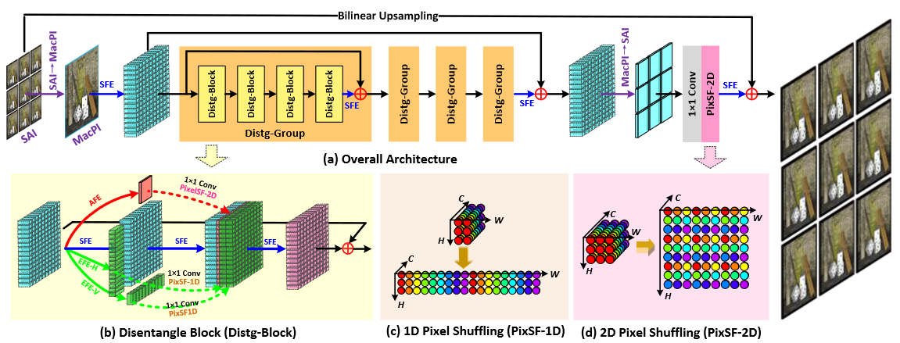
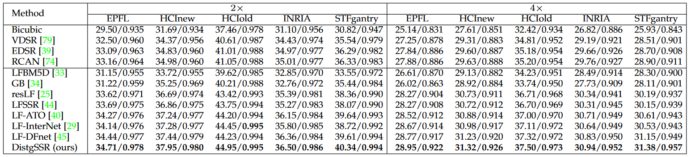
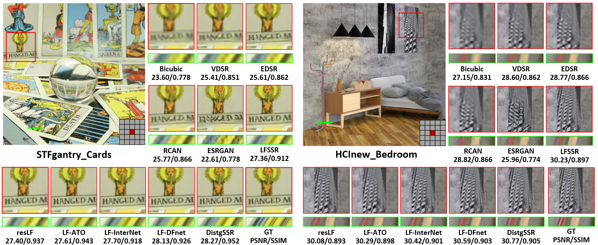
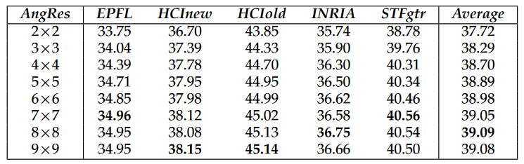
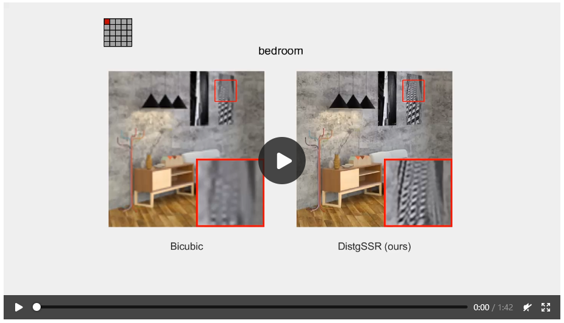

## DistgSSR: Disentangling Mechanism for Light Field Statial Super-Resolution
<br>

**This is the PyTorch implementation of the spatial SR method in our paper "*Disentangling Light Fields for Super-Resolution and Disparity Estimation*". Please refer to our [paper](https://yingqianwang.github.io/) and [project page](https://yingqianwang.github.io/DistgLF) for details.**<br><br>

## Network Architecture:
<p align="center">  </p>
<br><br>

## Codes and Models:

### Requirement:
* **PyTorch 1.3.0, torchvision 0.4.1. The code is tested with python=3.6, cuda=9.0.**
* **Matlab (For training/test data generation and performance evaluation)**

### Datasets:
**We used the EPFL, HCInew, HCIold, INRIA and STFgantry datasets for training and test. Please first download our dataset via [Baidu Drive](https://pan.baidu.com/s/1mYQR6OBXoEKrOk0TjV85Yw) (key:7nzy) or [OneDrive](https://stuxidianeducn-my.sharepoint.com/:f:/g/personal/zyliang_stu_xidian_edu_cn/EpkUehGwOlFIuSSdadq9S4MBEeFkNGPD_DlzkBBmZaV_mA?e=FiUeiv), and place the 5 datasets to the folder **`./datasets/`**.**

### Train:
* Run **`Generate_Data_for_Training.m`** to generate training data. The generated data will be saved in `./data_for_train/` (SR_5x5_2x, SR_5x5_4x).
* Run `train.py` to perform network training.
* Checkpoint will be saved to **`./log/`.

### Test:
* Run `Generate_Data_for_Test.m` to generate test data. The generated data will be saved in `./data_for_test/` (SR_5x5_2x, SR_5x5_4x).
* Run `test.py` to perform network inference.
* The PSNR and SSIM values of each dataset will be saved to `./log/`.
<br><br>

## Results:

### Quantitative Results:
<p align="center">  </p>

### Visual Comparisons:
<p align="center">  </p>

### Efficiency:
<p align="center">  </p>

### Performance w.r.t. Anggular Resolution:
<p align="center">  </p>

### Angular Consistency:
<p align="center"> <a href="https://wyqdatabase.s3.us-west-1.amazonaws.com/DistgLF-SpatialSR.mp4"></a> </p>


## Citiation
**If you find this work helpful, please consider citing:**
```
@Article{DistgLF,
    author    = {Wang, Yingqian and Wang, Longguang and Wu, Gaochang and Yang, Jungang and An, Wei and Yu, Jingyi and Guo, Yulan},
    title     = {Disentangling Light Fields for Super-Resolution and Disparity Estimation},
    journal   = {IEEE TPAMI (under review)}, 
    year      = {2022},   
}
```
<br>

## Contact
**Welcome to raise issues or email to [wangyingqian16@nudt.edu.cn](wangyingqian16@nudt.edu.cn) for any question regarding this work.**
